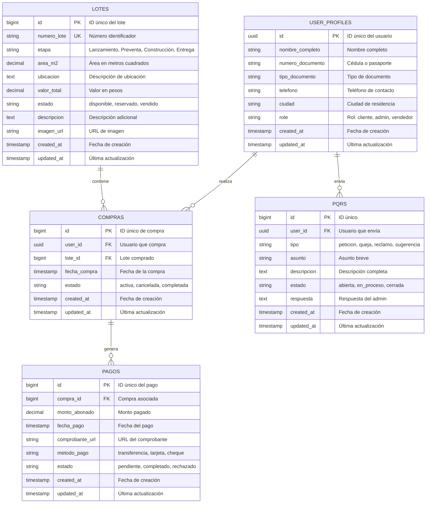

# Modelo de Base de Datos - Diagrama ERD

## Diagrama Entidad-Relación (ER)



## Descripción de Tablas

### USER_PROFILES
**Propósito**: Almacenar información extendida del usuario

**Campos clave**:
- `id`: Referencia a `auth.users` de Supabase
- `role`: Define permisos (cliente, admin, vendedor)

**Índices**: 
- Clave primaria en `id`

---

### LOTES
**Propósito**: Catálogo de lotes disponibles

**Campos clave**:
- `numero_lote`: Identificador único del lote
- `etapa`: Fase del proyecto
- `estado`: Controla disponibilidad
- `valor_total`: Precio de venta

**Índices**:
- PK: `id`
- UK: `numero_lote`
- Índice en `estado`
- Índice en `etapa`

---

### COMPRAS
**Propósito**: Registro de compras (relación Cliente-Lote)

**Campos clave**:
- `user_id`: Cliente que compra
- `lote_id`: Lote comprado
- `estado`: Controla el ciclo de vida

**Relaciones**:
- N:1 con USERS
- N:1 con LOTES
- 1:N con PAGOS

**Índices**:
- PK: `id`
- FK: `user_id`, `lote_id`
- UK: `(user_id, lote_id)` - Un lote por usuario

---

### PAGOS
**Propósito**: Registro de todos los abonos

**Campos clave**:
- `compra_id`: Compra asociada
- `monto_abonado`: Cantidad pagada
- `estado`: Validación del pago

**Relación**:
- Muchos pagos por cada compra

**Índices**:
- PK: `id`
- FK: `compra_id`

**Fórmula de Cálculo**:
```
SALDO_PENDIENTE = LOTE.valor_total - SUM(PAGOS.monto_abonado)
WHERE PAGOS.compra_id = COMPRAS.id 
  AND PAGOS.estado = 'completado'
```

---

### PQRS
**Propósito**: Sistema de peticiones, quejas, reclamos y sugerencias

**Campos clave**:
- `tipo`: Clasificación (enum)
- `estado`: Flujo de trabajo (abierta → en_proceso → cerrada)

**Relación**:
- N:1 con USERS

**Índices**:
- FK: `user_id`
- Índice en `estado`

---

## Restricciones de Seguridad (RLS)

```sql
-- Lotes: Todos pueden ver
CREATE POLICY "public_view_lotes" ON lotes
  FOR SELECT USING (true);

-- Compras: Cada usuario ve solo las suyas, admins ven todas
CREATE POLICY "user_compras" ON compras
  FOR SELECT USING (auth.uid() = user_id OR role = 'admin');

-- Pagos: Vinculados a compras del usuario
CREATE POLICY "user_pagos" ON pagos
  FOR SELECT USING (
    EXISTS (SELECT 1 FROM compras 
            WHERE compras.id = pagos.compra_id 
            AND compras.user_id = auth.uid())
    OR role = 'admin'
  );

-- PQRS: Usuario ve sus PQRS, admin ve todas
CREATE POLICY "user_pqrs" ON pqrs
  FOR SELECT USING (auth.uid() = user_id OR role = 'admin');
```

---

## Flujo de Datos

### Compra de un Lote
```
1. Cliente crea COMPRA (user_id + lote_id)
   ↓
2. Lote cambia estado de 'disponible' → 'reservado'
   ↓
3. Cliente realiza primer PAGO
   ↓
4. Se envía correo automático con comprobante
   ↓
5. Se actualiza el SALDO_PENDIENTE en el perfil
```

### Cambio de Estado de Lote
```
Disponible → Reservado (cuando hay COMPRA)
         ↓
Reservado → Vendido (cuando SALDO_PENDIENTE = 0)
```

---

## Performance

### Índices Creados
- `idx_compras_user_id`: Querys por usuario
- `idx_compras_lote_id`: Querys por lote
- `idx_lotes_estado`: Filtrado de disponibilidad
- `idx_lotes_etapa`: Filtrado por etapa
- `idx_pagos_compra_id`: Agregaciones de pagos
- `idx_pqrs_user_id`: Querys de PQRS del usuario
- `idx_pqrs_estado`: Filtrado de PQRS abiertas

### Función Plpgsql
```sql
calcular_saldo_pendiente(compra_id)
  → Retorna DECIMAL
  → Ejecuta SELECT con SUM()
  → Usada en reportes y estados de cuenta
```

---

## Notas de Implementación

1. **Row Level Security (RLS)**: Activado en todas las tablas
2. **Triggers**: Auto-actualizar `updated_at` en cada tabla
3. **Cascada**: Eliminar usuario elimina sus compras, pagos, PQRS
4. **Restricción**: No se puede eliminar lote si tiene compra activa
5. **Validación**: Estados controlados por CHECK constraints

---

*Diagrama actualizado: Marzo 2025*
